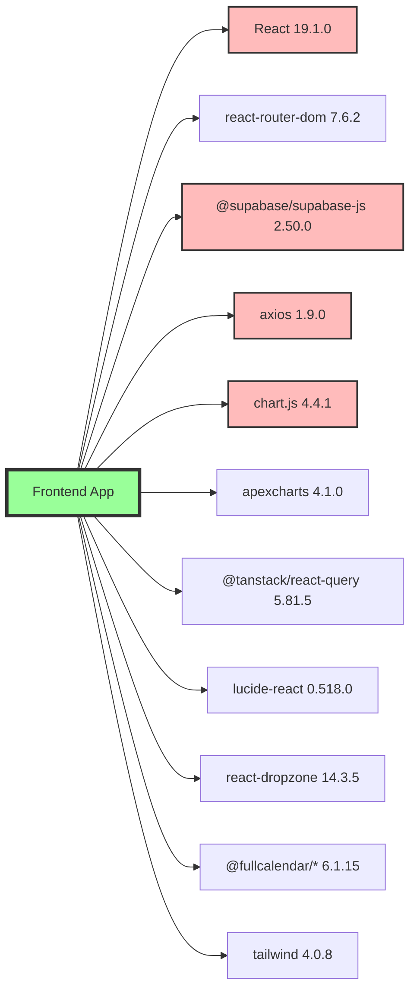
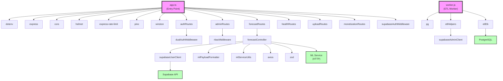
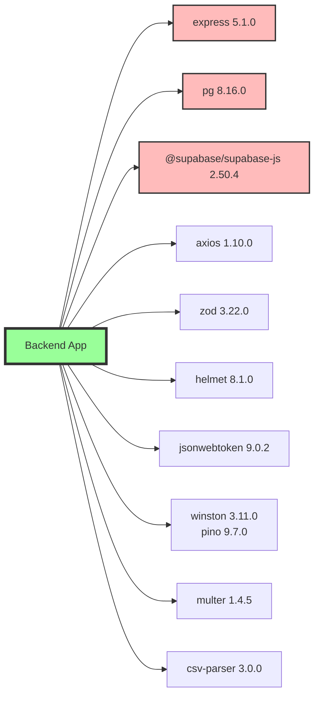
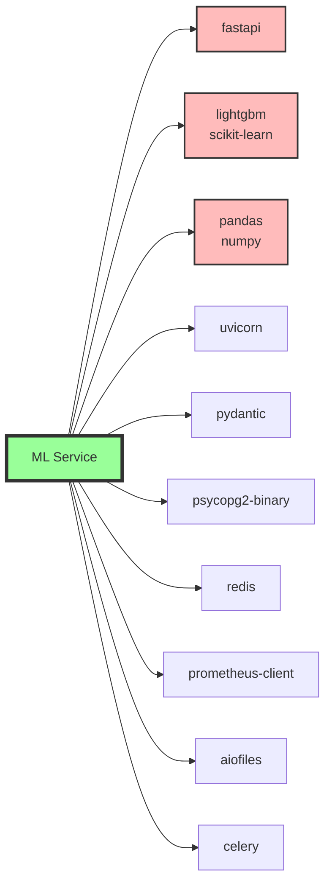
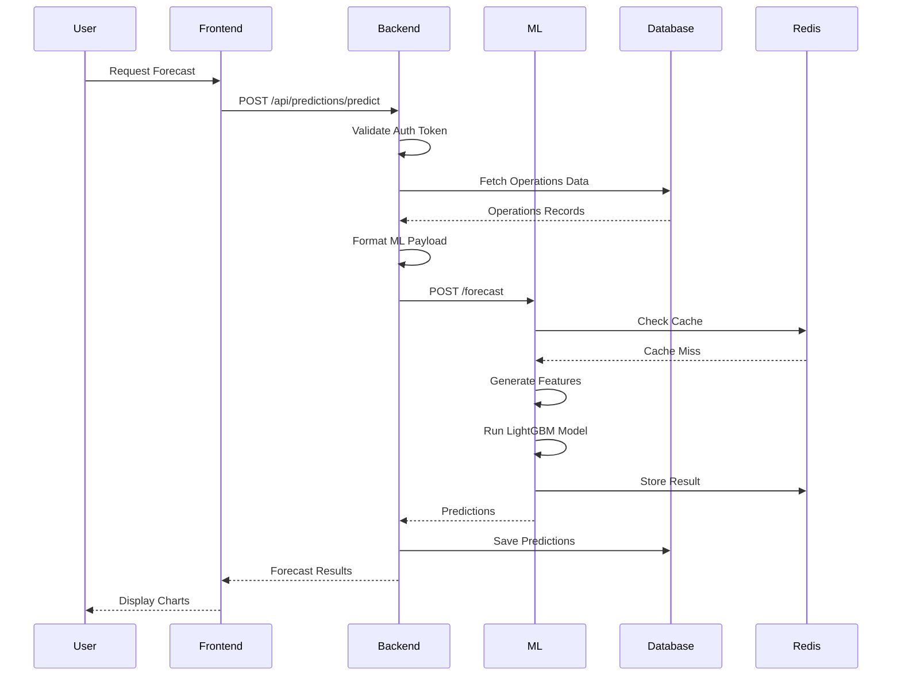

```mermaid
graph TD
    %% Entry Point
    main.tsx["main.tsx<br/>(Entry Point)"] --> App.tsx
    main.tsx --> index.css
    main.tsx --> ThemeProvider
    main.tsx --> AuthProvider
    main.tsx --> QueryClient["@tanstack/react-query"]
    main.tsx --> BrowserRouter["react-router-dom"]
    main.tsx --> ErrorBoundary
    
    %% App Component Dependencies
    App.tsx --> Routes["react-router-dom Routes"]
    App.tsx --> supabaseClient
    App.tsx --> ProtectedRoute
    App.tsx --> AppLayout
    App.tsx --> LazyComponents["Lazy Loaded Pages"]
    
    %% Context Providers
    AuthContext --> supabaseClient
    AuthContext --> axios
    AuthContext --> Session["@supabase/supabase-js"]
    
    ThemeContext --> localStorage
    ThemeContext --> DocumentRoot["document.documentElement"]
    
    SidebarContext --> WindowAPI["window.innerWidth"]
    
    %% API Layer
    forecast.ts --> axios
    forecast.ts --> localStorage
    forecast.ts --> MLError["Error Handling"]
    
    %% Layout Components
    AppLayout --> AppSidebar
    AppLayout --> AppHeader
    AppLayout --> SidebarContext
    AppLayout --> Backdrop
    
    %% Pages
    SalesForecastPage --> Chart.js
    SalesForecastPage --> useForecast
    SalesForecastPage --> forecast.ts
    
    %% External Dependencies
    style main.tsx fill:#f9f,stroke:#333,stroke-width:4px
    style AuthContext fill:#bbf,stroke:#333,stroke-width:2px
    style forecast.ts fill:#bbf,stroke:#333,stroke-width:2px
    style Chart.js fill:#fbb,stroke:#333,stroke-width:2px
    style axios fill:#fbb,stroke:#333,stroke-width:2px
    style supabaseClient fill:#fbb,stroke:#333,stroke-width:2px
```

```mermaid
graph TD
    %% Entry Point
    api_main.py["api_main.py<br/>(Entry Point)"] --> fastapi["FastAPI"]
    api_main.py --> pydantic
    api_main.py --> pandas
    api_main.py --> numpy
    api_main.py --> pickle
    
    %% Internal Modules
    api_main.py --> features
    api_main.py --> error_handler
    api_main.py --> cache_manager
    api_main.py --> metrics_collector
    
    %% Model Loading
    api_main.py --> load_latest_model
    load_latest_model --> MODEL["model-*.pkl"]
    
    %% Feature Engineering
    features --> LagMaker
    features --> safe_mape
    
    %% Error Handling
    error_handler --> ModelError
    error_handler --> DataProcessingError
    error_handler --> ExternalServiceError
    
    %% Caching & Metrics
    cache_manager --> redis
    cache_manager --> hashlib
    metrics_collector --> prometheus_client
    
    %% Training Pipeline
    train.py --> lightgbm
    train.py --> sklearn
    train.py --> pandas
    train.py --> features
    
    %% External Services
    api_main.py --> REDIS["Redis Cache"]
    api_main.py --> POSTGRES["PostgreSQL<br/>(if needed)"]
    
    style api_main.py fill:#f9f,stroke:#333,stroke-width:4px
    style train.py fill:#f9f,stroke:#333,stroke-width:4px
    style REDIS fill:#bfb,stroke:#333,stroke-width:2px
    style POSTGRES fill:#bfb,stroke:#333,stroke-width:2px
```

# Карты зависимостей системы

## 1. Frontend Dependencies

### Import Graph

### Critical External Packages

## 2. Backend Dependencies

### Import Graph

### Critical External Packages

## 3. ML Service Dependencies

### Import Graph

### Critical External Packages

## 4. System-Wide Data Flow

### Sales Forecasting Chain

## 5. Critical Dependencies Summary

### Frontend
- **Core**: React 19, React Router 7
- **Authentication**: Supabase JS Client
- **Data Fetching**: Axios, React Query
- **Visualization**: Chart.js, ApexCharts
- **UI**: Tailwind CSS, Lucide Icons

### Backend
- **Core**: Express 5, Node.js
- **Database**: PostgreSQL (pg), Supabase
- **Security**: Helmet, JWT, Rate Limiting
- **Validation**: Zod
- **Logging**: Winston, Pino

### ML Service
- **Core**: FastAPI, Python
- **ML**: LightGBM, Scikit-learn
- **Data**: Pandas, NumPy
- **Caching**: Redis
- **Monitoring**: Prometheus

### Inter-Service Communication
- Frontend ↔ Backend: REST API (Axios)
- Backend ↔ ML Service: REST API (Axios)
- Backend ↔ Database: pg/Supabase Client
- ML Service ↔ Redis: Redis Client
- Backend ↔ Supabase: Supabase Admin/User Clients
