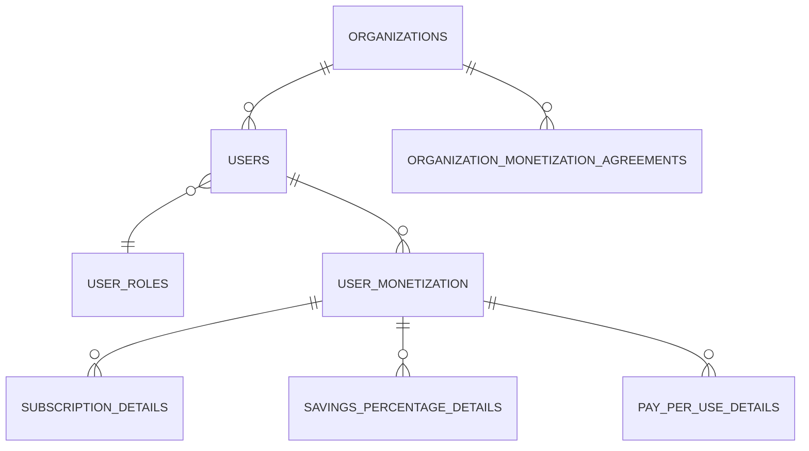

# Схема базы данных

## Основные таблицы

- **organizations** — организации (id, name, address, created_at, ...)
- **users** — пользователи (id, email, password_hash, organization_id, role, ...)
- **user_roles** — роли пользователей (id, role_code, role_name, ...)
- **monetization_model_types / monetization_types** — типы моделей монетизации
- **organization_monetization_agreements** — соглашения по монетизации для организаций
- **user_monetization** — монетизация на уровне пользователя
- **subscription_details** — детали подписки пользователя
- **savings_percentage_details** — детали по проценту экономии
- **pay_per_use_details** — детали по оплате за использование

## Ключевые связи

- Один пользователь принадлежит одной организации (users.organization_id → organizations.id)
- Пользователь может иметь одну роль (users.role_id → user_roles.id)
- Организация может иметь несколько соглашений по монетизации (organization_monetization_agreements)
- Пользователь может иметь несколько моделей монетизации (user_monetization)
- Детализация монетизации пользователя хранится в отдельных таблицах (subscription_details, savings_percentage_details, pay_per_use_details)

## Визуальная схема (Mermaid)

