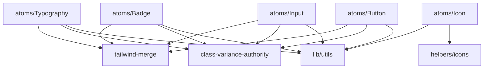
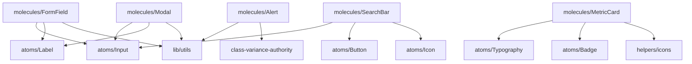
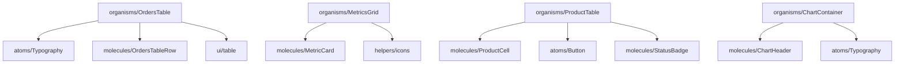

# Детальный анализ зависимостей для миграции FSD

## 1. Матрица зависимостей компонентов

### 1.1 Atoms Dependencies



### 1.2 Molecules Dependencies



### 1.3 Organisms Dependencies



## 2. Проблемные зависимости

### 2.1 Циклические зависимости

**Проблема 1: Дублирование FormField**
```
atoms/FormField.tsx  ←→  molecules/FormField.tsx
```
**Решение**: Удалить из atoms, оставить только в molecules

**Проблема 2: Глубокие импорты**
```
organisms/OrdersTable → molecules/OrdersTableRow → atoms/Typography
```
**Решение**: Переместить Typography в shared/ui/atoms

**Проблема 3: Неправильная иерархия**
```
templates/RecentOrdersWidget → organisms/OrdersTable
```
**Решение**: Переместить в widgets/RecentOrdersWidget

### 2.2 Нарушения принципов FSD

**Нарушение 1: Прямые импорты компонентов**
```typescript
// Неправильно
import { Button } from '../../atoms/Button';

// Правильно
import { Button } from '@/shared/ui/atoms/Button';
```

**Нарушение 2: Импорты снизу вверх**
```typescript
// Неправильно в atoms/Card.tsx
import { MetricCard } from '../molecules/MetricCard';

// Правильно - atoms не должны знать о molecules
```

**Нарушение 3: Бизнес-логика в UI компонентах**
```typescript
// Неправильно в organisms/OrdersTable.tsx
const fetchOrders = async () => {
  const response = await api.get('/orders');
  return response.data;
};

// Правильно - в features/orders/api/
```

## 3. Карта импортов по слоям

### 3.1 Shared Layer

```typescript
// shared/ui/atoms/Button/index.ts
export { Button } from './Button';
export type { ButtonProps } from './Button';

// shared/ui/molecules/FormField/index.ts
export { FormField } from './FormField';
export type { FormFieldProps } from './FormField';

// shared/api/base/index.ts
export { api } from './api';
export { authAPI } from './authAPI';

// shared/lib/utils/index.ts
export { cn } from './cn';
export { formatDate } from './formatDate';
```

### 3.2 Entities Layer

```typescript
// entities/user/model/index.ts
export { userModel } from './userModel';
export type { User, UserProfile } from './types';

// entities/user/api/index.ts
export { userAPI } from './userAPI';

// entities/order/model/index.ts
export { orderModel } from './orderModel';
export type { Order, OrderStatus } from './types';

// entities/product/model/index.ts
export { productModel } from './productModel';
export type { Product, Category } from './types';
```

### 3.3 Features Layer

```typescript
// features/auth/ui/index.ts
export { SignInForm } from './SignInForm';
export { SignUpForm } from './SignUpForm';
export { ProtectedRoute } from './ProtectedRoute';

// features/auth/model/index.ts
export { authModel } from './authModel';
export { useAuth } from './useAuth';

// features/orders/ui/index.ts
export { OrdersTable } from './OrdersTable';
export { OrderForm } from './OrderForm';

// features/orders/model/index.ts
export { ordersModel } from './ordersModel';
export { useOrders } from './useOrders';
```

### 3.4 Widgets Layer

```typescript
// widgets/MetricsGrid/index.ts
export { MetricsGrid } from './MetricsGrid';
export type { MetricsGridProps } from './MetricsGrid';

// widgets/header/index.ts
export { Header } from './Header';
export { NotificationDropdown } from './NotificationDropdown';
export { UserDropdown } from './UserDropdown';

// widgets/charts/index.ts
export { BarChart } from './BarChart';
export { LineChart } from './LineChart';
export { StatisticsChart } from './StatisticsChart';
```

## 4. Анализ API зависимостей

### 4.1 Текущие API сервисы

```typescript
// services/api.ts
export const authAPI = {
  checkEmailUnique: (email: string) => Promise<boolean>,
  getProfile: () => Promise<UserProfile>,
  register: (userData: RegisterData) => Promise<User>,
  updateProfile: (userData: UpdateData) => Promise<User>,
  logout: () => Promise<void>,
  resetPassword: (email: string) => Promise<ResetResponse>
};

// services/outOfStockService.ts
export const outOfStockService = {
  getOutOfStockItems: () => Promise<OutOfStockItem[]>,
  updateStockLevel: (id: string, level: number) => Promise<void>
};

// services/warehouseApi.ts
export const warehouseAPI = {
  getWarehouses: () => Promise<Warehouse[]>,
  createWarehouse: (data: CreateWarehouseData) => Promise<Warehouse>,
  updateWarehouse: (id: string, data: UpdateWarehouseData) => Promise<Warehouse>
};
```

### 4.2 Новая структура API

```typescript
// shared/api/base/index.ts
export { api } from './api';
export { createApiClient } from './createApiClient';

// shared/api/supabase/index.ts
export { supabase } from './supabaseClient';
export { createSupabaseClient } from './createSupabaseClient';

// entities/user/api/index.ts
export const userAPI = {
  getProfile: () => Promise<User>,
  updateProfile: (data: UpdateUserData) => Promise<User>,
  checkEmailUnique: (email: string) => Promise<boolean>
};

// entities/order/api/index.ts
export const orderAPI = {
  getOrders: (filters?: OrderFilters) => Promise<Order[]>,
  createOrder: (data: CreateOrderData) => Promise<Order>,
  updateOrder: (id: string, data: UpdateOrderData) => Promise<Order>,
  deleteOrder: (id: string) => Promise<void>
};

// features/auth/api/index.ts
export const authAPI = {
  signIn: (email: string, password: string) => Promise<AuthResponse>,
  signUp: (email: string, password: string) => Promise<AuthResponse>,
  signOut: () => Promise<void>,
  resetPassword: (email: string) => Promise<ResetResponse>
};

// features/inventory/api/index.ts
export const inventoryAPI = {
  getOutOfStockItems: () => Promise<OutOfStockItem[]>,
  updateStockLevel: (id: string, level: number) => Promise<void>,
  getShelfAvailability: () => Promise<ShelfAvailability[]>
};
```

## 5. Модели данных и состояние

### 5.1 Entities Models

```typescript
// entities/user/model/userModel.ts
export interface User {
  id: string;
  email: string;
  role: UserRole;
  profile: UserProfile;
  organization_id: string;
  location_id: string;
}

export interface UserProfile {
  full_name: string;
  phone?: string;
  position?: string;
  avatar?: string;
}

export enum UserRole {
  ADMIN = 'admin',
  MANAGER = 'manager',
  USER = 'user'
}

// entities/order/model/orderModel.ts
export interface Order {
  id: string;
  user_id: string;
  products: OrderProduct[];
  status: OrderStatus;
  total_amount: number;
  created_at: string;
  updated_at: string;
}

export interface OrderProduct {
  product_id: string;
  quantity: number;
  price: number;
  product: Product;
}

export enum OrderStatus {
  PENDING = 'pending',
  PROCESSING = 'processing',
  DELIVERED = 'delivered',
  CANCELLED = 'cancelled'
}

// entities/product/model/productModel.ts
export interface Product {
  id: string;
  name: string;
  category: Category;
  price: number;
  stock_quantity: number;
  description?: string;
  image?: string;
  variants?: ProductVariant[];
}

export interface Category {
  id: string;
  name: string;
  parent_id?: string;
}

export interface ProductVariant {
  id: string;
  name: string;
  value: string;
  price_modifier?: number;
}
```

### 5.2 Features Models

```typescript
// features/auth/model/authModel.ts
export interface AuthState {
  user: User | null;
  session: Session | null;
  loading: boolean;
  error: string | null;
}

export interface AuthActions {
  signIn: (email: string, password: string) => Promise<void>;
  signUp: (email: string, password: string) => Promise<void>;
  signOut: () => Promise<void>;
  resetPassword: (email: string) => Promise<void>;
  clearError: () => void;
}

// features/orders/model/ordersModel.ts
export interface OrdersState {
  orders: Order[];
  selectedOrders: string[];
  filters: OrderFilters;
  pagination: Pagination;
  loading: boolean;
  error: string | null;
}

export interface OrderFilters {
  status?: OrderStatus;
  dateRange?: DateRange;
  search?: string;
}

export interface Pagination {
  page: number;
  limit: number;
  total: number;
  totalPages: number;
}

// features/inventory/model/inventoryModel.ts
export interface InventoryState {
  outOfStockItems: OutOfStockItem[];
  shelfAvailability: ShelfAvailability[];
  loading: boolean;
  error: string | null;
}

export interface OutOfStockItem {
  id: string;
  product_id: string;
  product: Product;
  current_stock: number;
  min_stock: number;
  warehouse_id: string;
  last_updated: string;
}

export interface ShelfAvailability {
  id: string;
  shelf_id: string;
  available_space: number;
  total_space: number;
  utilization: number;
  warehouse_id: string;
}
```

## 6. Hooks и утилиты

### 6.1 Shared Hooks

```typescript
// shared/lib/hooks/useDebounce.ts
export function useDebounce<T>(value: T, delay: number): T;

// shared/lib/hooks/useLocalStorage.ts
export function useLocalStorage<T>(key: string, initialValue: T): [T, (value: T) => void];

// shared/lib/hooks/useApi.ts
export function useApi<T>(apiCall: () => Promise<T>): {
  data: T | null;
  loading: boolean;
  error: string | null;
  refetch: () => void;
};

// shared/lib/hooks/usePagination.ts
export function usePagination(totalItems: number, itemsPerPage: number): {
  currentPage: number;
  totalPages: number;
  goToPage: (page: number) => void;
  nextPage: () => void;
  prevPage: () => void;
};
```

### 6.2 Feature Hooks

```typescript
// features/auth/model/useAuth.ts
export function useAuth(): {
  user: User | null;
  session: Session | null;
  loading: boolean;
  error: string | null;
  signIn: (email: string, password: string) => Promise<void>;
  signUp: (email: string, password: string) => Promise<void>;
  signOut: () => Promise<void>;
  resetPassword: (email: string) => Promise<void>;
};

// features/orders/model/useOrders.ts
export function useOrders(filters?: OrderFilters): {
  orders: Order[];
  loading: boolean;
  error: string | null;
  createOrder: (data: CreateOrderData) => Promise<void>;
  updateOrder: (id: string, data: UpdateOrderData) => Promise<void>;
  deleteOrder: (id: string) => Promise<void>;
  refetch: () => void;
};

// features/inventory/model/useInventory.ts
export function useInventory(): {
  outOfStockItems: OutOfStockItem[];
  shelfAvailability: ShelfAvailability[];
  loading: boolean;
  error: string | null;
  updateStockLevel: (id: string, level: number) => Promise<void>;
  refetch: () => void;
};
```

## 7. Рекомендации по рефакторингу

### 7.1 Порядок миграции

1. **Этап 1**: Создать shared/ui структуру
2. **Этап 2**: Переместить atoms компоненты
3. **Этап 3**: Переместить molecules компоненты
4. **Этап 4**: Создать entities слой
5. **Этап 5**: Переместить API в соответствующие слои
6. **Этап 6**: Создать features слой
7. **Этап 7**: Переместить organisms в features/widgets
8. **Этап 8**: Создать widgets слой
9. **Этап 9**: Обновить pages
10. **Этап 10**: Создать app слой

### 7.2 Инструменты для автоматизации

```json
// .eslintrc.js
{
  "extends": ["@feature-sliced/eslint-config"],
  "rules": {
    "@feature-sliced/layers-slices": "error",
    "@feature-sliced/absolute-relative": "error",
    "@feature-sliced/public-api": "error"
  }
}
```

```typescript
// scripts/migrate-imports.ts
import { Project } from 'ts-morph';

const project = new Project({
  tsConfigFilePath: './tsconfig.json',
});

// Автоматическое обновление импортов
function migrateImports() {
  const sourceFiles = project.getSourceFiles();
  
  sourceFiles.forEach(file => {
    const importDeclarations = file.getImportDeclarations();
    
    importDeclarations.forEach(importDecl => {
      const moduleSpecifier = importDecl.getModuleSpecifierValue();
      
      if (moduleSpecifier.startsWith('../atoms/')) {
        const newPath = moduleSpecifier.replace('../atoms/', '@/shared/ui/atoms/');
        importDecl.setModuleSpecifier(newPath);
      }
      
      if (moduleSpecifier.startsWith('../molecules/')) {
        const newPath = moduleSpecifier.replace('../molecules/', '@/shared/ui/molecules/');
        importDecl.setModuleSpecifier(newPath);
      }
    });
  });
  
  project.save();
}
```

### 7.3 Тестирование после миграции

```typescript
// __tests__/migration.test.ts
import { render, screen } from '@testing-library/react';
import { Button } from '@/shared/ui/atoms/Button';
import { FormField } from '@/shared/ui/molecules/FormField';
import { OrdersTable } from '@/features/orders/ui/OrdersTable';

describe('Migration Tests', () => {
  test('Button component renders correctly', () => {
    render(<Button>Test Button</Button>);
    expect(screen.getByText('Test Button')).toBeInTheDocument();
  });

  test('FormField component renders correctly', () => {
    render(<FormField label="Test Field" />);
    expect(screen.getByText('Test Field')).toBeInTheDocument();
  });

  test('OrdersTable component renders correctly', () => {
    const orders = [
      { id: '1', name: 'Test Order', status: 'pending' }
    ];
    render(<OrdersTable orders={orders} />);
    expect(screen.getByText('Test Order')).toBeInTheDocument();
  });
});
```

## 8. Результат миграции

После успешной миграции проект будет иметь:

1. **Четкую архитектуру** с разделением по слоям
2. **Отсутствие циклических зависимостей**
3. **Переиспользуемые компоненты** в shared
4. **Изолированные features** с собственной логикой
5. **Масштабируемую структуру** для будущего развития
6. **Улучшенную читаемость** и поддерживаемость кода
7. **Автоматическую проверку** архитектурных правил через ESLint

Эта миграция позволит команде разработчиков более эффективно работать с кодом и быстрее добавлять новые функции в приложение.
